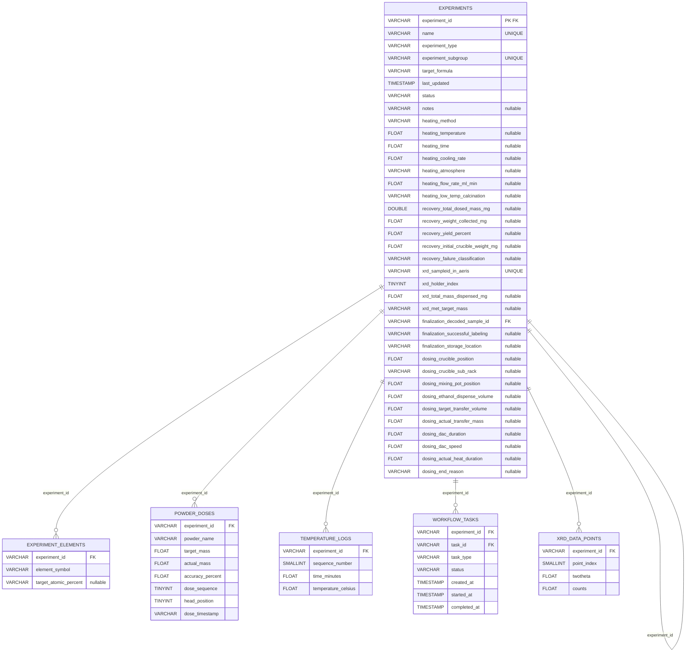

# Parquet Schema Documentation

**Auto-generated from MongoDB → Parquet transformation**

- **Tables:** 6
- **Total Rows:** 5,298,805
- **Relationships:** 6

---

## Table Overview

| Table               |      Rows | Description                                             |
| ------------------- | --------: | ------------------------------------------------------- |
| experiment_elements |     2,666 | Elements present in each experiment                     |
| experiments         |       592 | Main experiment records with target formulas and status |
| powder_doses        |    11,069 | Individual powder doses with accuracy tracking          |
| temperature_logs    |   500,997 | Time-series temperature measurements during heating     |
| workflow_tasks      |     3,074 | Lab automation workflow task tracking                   |
| xrd_data_points     | 4,780,407 | Raw XRD diffraction pattern data (2θ vs counts)         |

---

## Table Details

### experiment_elements

- **Rows:** 2,666
- **Primary Key:** None
- **Foreign Keys:** `experiment_id` → `experiment`

| Column                | Type    | Nullable | Notes           |
| --------------------- | ------- | -------- | --------------- |
| experiment_id         | VARCHAR | No       | FK → experiment |
| element_symbol        | VARCHAR | No       | -               |
| target_atomic_percent | VARCHAR | Yes      | -               |

### experiments

- **Rows:** 592
- **Primary Key:** `experiment_id`
- **Foreign Keys:** `experiment_id` → `experiment`, `finalization_decoded_sample_id` → `finalization_decoded_sample`

| Column                              | Type      | Nullable | Notes                            |
| ----------------------------------- | --------- | -------- | -------------------------------- |
| experiment_id                       | VARCHAR   | No       | Primary Key, FK → experiment     |
| name                                | VARCHAR   | No       | Unique                           |
| experiment_type                     | VARCHAR   | No       | -                                |
| experiment_subgroup                 | VARCHAR   | No       | Unique                           |
| target_formula                      | VARCHAR   | No       | -                                |
| last_updated                        | TIMESTAMP | No       | -                                |
| status                              | VARCHAR   | No       | -                                |
| notes                               | VARCHAR   | Yes      | -                                |
| heating_method                      | VARCHAR   | No       | -                                |
| heating_temperature                 | FLOAT     | Yes      | -                                |
| heating_time                        | FLOAT     | Yes      | -                                |
| heating_cooling_rate                | FLOAT     | Yes      | -                                |
| heating_atmosphere                  | VARCHAR   | Yes      | -                                |
| heating_flow_rate_ml_min            | FLOAT     | Yes      | -                                |
| heating_low_temp_calcination        | VARCHAR   | Yes      | -                                |
| recovery_total_dosed_mass_mg        | DOUBLE    | Yes      | -                                |
| recovery_weight_collected_mg        | FLOAT     | Yes      | -                                |
| recovery_yield_percent              | FLOAT     | Yes      | -                                |
| recovery_initial_crucible_weight_mg | FLOAT     | Yes      | -                                |
| recovery_failure_classification     | VARCHAR   | Yes      | -                                |
| xrd_sampleid_in_aeris               | VARCHAR   | No       | Unique                           |
| xrd_holder_index                    | TINYINT   | No       | -                                |
| xrd_total_mass_dispensed_mg         | FLOAT     | Yes      | -                                |
| xrd_met_target_mass                 | VARCHAR   | Yes      | -                                |
| finalization_decoded_sample_id      | VARCHAR   | Yes      | FK → finalization_decoded_sample |
| finalization_successful_labeling    | VARCHAR   | Yes      | -                                |
| finalization_storage_location       | VARCHAR   | Yes      | -                                |
| dosing_crucible_position            | FLOAT     | Yes      | -                                |
| dosing_crucible_sub_rack            | VARCHAR   | Yes      | -                                |
| dosing_mixing_pot_position          | FLOAT     | Yes      | -                                |
| dosing_ethanol_dispense_volume      | FLOAT     | Yes      | -                                |
| dosing_target_transfer_volume       | FLOAT     | Yes      | -                                |
| dosing_actual_transfer_mass         | FLOAT     | Yes      | -                                |
| dosing_dac_duration                 | FLOAT     | Yes      | -                                |
| dosing_dac_speed                    | FLOAT     | Yes      | -                                |
| dosing_actual_heat_duration         | FLOAT     | Yes      | -                                |
| dosing_end_reason                   | VARCHAR   | Yes      | -                                |

### powder_doses

- **Rows:** 11,069
- **Primary Key:** None
- **Foreign Keys:** `experiment_id` → `experiment`

| Column           | Type    | Nullable | Notes           |
| ---------------- | ------- | -------- | --------------- |
| experiment_id    | VARCHAR | No       | FK → experiment |
| powder_name      | VARCHAR | No       | -               |
| target_mass      | FLOAT   | No       | -               |
| actual_mass      | FLOAT   | No       | -               |
| accuracy_percent | FLOAT   | No       | -               |
| dose_sequence    | TINYINT | No       | -               |
| head_position    | TINYINT | No       | -               |
| dose_timestamp   | VARCHAR | No       | -               |

### temperature_logs

- **Rows:** 500,997
- **Primary Key:** None
- **Foreign Keys:** `experiment_id` → `experiment`

| Column              | Type     | Nullable | Notes           |
| ------------------- | -------- | -------- | --------------- |
| experiment_id       | VARCHAR  | No       | FK → experiment |
| sequence_number     | SMALLINT | No       | -               |
| time_minutes        | FLOAT    | No       | -               |
| temperature_celsius | FLOAT    | No       | -               |

### workflow_tasks

- **Rows:** 3,074
- **Primary Key:** None
- **Foreign Keys:** `experiment_id` → `experiment`, `task_id` → `task`

| Column        | Type      | Nullable | Notes           |
| ------------- | --------- | -------- | --------------- |
| experiment_id | VARCHAR   | No       | FK → experiment |
| task_id       | VARCHAR   | No       | FK → task       |
| task_type     | VARCHAR   | No       | -               |
| status        | VARCHAR   | No       | -               |
| created_at    | TIMESTAMP | No       | -               |
| started_at    | TIMESTAMP | No       | -               |
| completed_at  | TIMESTAMP | No       | -               |

### xrd_data_points

- **Rows:** 4,780,407
- **Primary Key:** None
- **Foreign Keys:** `experiment_id` → `experiment`

| Column        | Type     | Nullable | Notes           |
| ------------- | -------- | -------- | --------------- |
| experiment_id | VARCHAR  | No       | FK → experiment |
| point_index   | SMALLINT | No       | -               |
| twotheta      | FLOAT    | No       | -               |
| counts        | FLOAT    | No       | -               |

---

## Relationships

| From                              | Type | To                        |
| --------------------------------- | ---- | ------------------------- |
| experiment_elements.experiment_id | 1:N  | experiments.experiment_id |
| experiments.experiment_id         | 1:1  | experiments.experiment_id |
| powder_doses.experiment_id        | 1:N  | experiments.experiment_id |
| temperature_logs.experiment_id    | 1:N  | experiments.experiment_id |
| workflow_tasks.experiment_id      | 1:N  | experiments.experiment_id |
| xrd_data_points.experiment_id     | 1:N  | experiments.experiment_id |

---

## Entity Relationship Diagram

