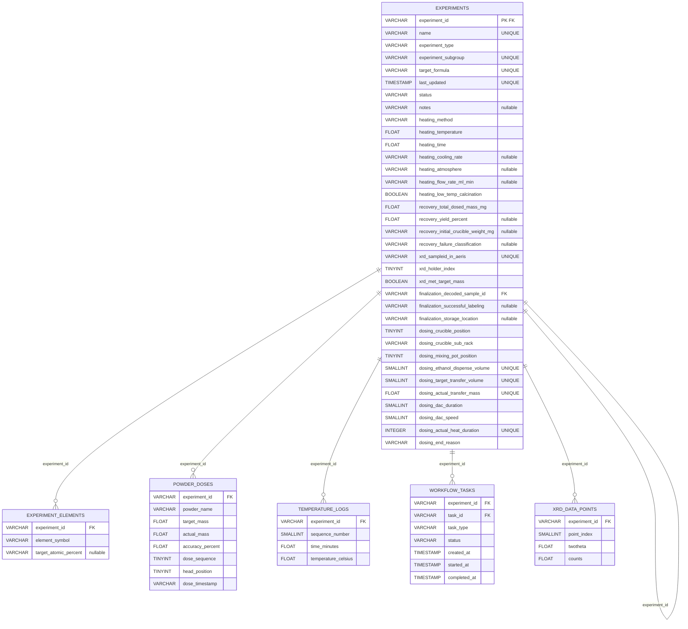

# example Schema Diagram

**Auto-generated by A-Lab Pipeline**

- **Product**: example
- **Tables**: 6
- **Total Rows**: 237,986
- **Generated**: 2025-12-18 17:43:01

---

# Parquet Schema Documentation

**Auto-generated from MongoDB → Parquet transformation**

- **Tables:** 6
- **Total Rows:** 237,986
- **Relationships:** 6

---

## Table Overview

| Table | Rows | Description |
|-------|-----:|-------------|
| experiment_elements | 108 | Elements present in each experiment |
| experiments | 23 | Main experiment records with target formulas and status |
| powder_doses | 495 | Individual powder doses with accuracy tracking |
| temperature_logs | 46,314 | Time-series temperature measurements during heating |
| workflow_tasks | 123 | Lab automation workflow task tracking |
| xrd_data_points | 190,923 | Raw XRD diffraction pattern data (2θ vs counts) |

---

## Table Details

### experiment_elements
- **Rows:** 108
- **Primary Key:** None
- **Foreign Keys:** `experiment_id` → `experiment`

| Column | Type | Nullable | Notes |
|--------|------|----------|-------|
| experiment_id | VARCHAR | No | FK → experiment |
| element_symbol | VARCHAR | No | - |
| target_atomic_percent | VARCHAR | Yes | - |

### experiments
- **Rows:** 23
- **Primary Key:** `experiment_id`
- **Foreign Keys:** `experiment_id` → `experiment`, `finalization_decoded_sample_id` → `finalization_decoded_sample`

| Column | Type | Nullable | Notes |
|--------|------|----------|-------|
| experiment_id | VARCHAR | No | Primary Key, FK → experiment |
| name | VARCHAR | No | Unique |
| experiment_type | VARCHAR | No | - |
| experiment_subgroup | VARCHAR | No | Unique |
| target_formula | VARCHAR | No | Unique |
| last_updated | TIMESTAMP | No | Unique |
| status | VARCHAR | No | - |
| notes | VARCHAR | Yes | - |
| heating_method | VARCHAR | No | - |
| heating_temperature | FLOAT | No | - |
| heating_time | FLOAT | No | - |
| heating_cooling_rate | VARCHAR | Yes | - |
| heating_atmosphere | VARCHAR | Yes | - |
| heating_flow_rate_ml_min | VARCHAR | Yes | - |
| heating_low_temp_calcination | BOOLEAN | No | - |
| recovery_total_dosed_mass_mg | FLOAT | No | - |
| recovery_yield_percent | FLOAT | Yes | - |
| recovery_initial_crucible_weight_mg | VARCHAR | Yes | - |
| recovery_failure_classification | VARCHAR | Yes | - |
| xrd_sampleid_in_aeris | VARCHAR | No | Unique |
| xrd_holder_index | TINYINT | No | - |
| xrd_met_target_mass | BOOLEAN | No | - |
| finalization_decoded_sample_id | VARCHAR | Yes | FK → finalization_decoded_sample |
| finalization_successful_labeling | VARCHAR | Yes | - |
| finalization_storage_location | VARCHAR | Yes | - |
| dosing_crucible_position | TINYINT | No | - |
| dosing_crucible_sub_rack | VARCHAR | No | - |
| dosing_mixing_pot_position | TINYINT | No | - |
| dosing_ethanol_dispense_volume | SMALLINT | No | Unique |
| dosing_target_transfer_volume | SMALLINT | No | Unique |
| dosing_actual_transfer_mass | FLOAT | No | Unique |
| dosing_dac_duration | SMALLINT | No | - |
| dosing_dac_speed | SMALLINT | No | - |
| dosing_actual_heat_duration | INTEGER | No | Unique |
| dosing_end_reason | VARCHAR | No | - |

### powder_doses
- **Rows:** 495
- **Primary Key:** None
- **Foreign Keys:** `experiment_id` → `experiment`

| Column | Type | Nullable | Notes |
|--------|------|----------|-------|
| experiment_id | VARCHAR | No | FK → experiment |
| powder_name | VARCHAR | No | - |
| target_mass | FLOAT | No | - |
| actual_mass | FLOAT | No | - |
| accuracy_percent | FLOAT | No | - |
| dose_sequence | TINYINT | No | - |
| head_position | TINYINT | No | - |
| dose_timestamp | VARCHAR | No | - |

### temperature_logs
- **Rows:** 46,314
- **Primary Key:** None
- **Foreign Keys:** `experiment_id` → `experiment`

| Column | Type | Nullable | Notes |
|--------|------|----------|-------|
| experiment_id | VARCHAR | No | FK → experiment |
| sequence_number | SMALLINT | No | - |
| time_minutes | FLOAT | No | - |
| temperature_celsius | FLOAT | No | - |

### workflow_tasks
- **Rows:** 123
- **Primary Key:** None
- **Foreign Keys:** `experiment_id` → `experiment`, `task_id` → `task`

| Column | Type | Nullable | Notes |
|--------|------|----------|-------|
| experiment_id | VARCHAR | No | FK → experiment |
| task_id | VARCHAR | No | FK → task |
| task_type | VARCHAR | No | - |
| status | VARCHAR | No | - |
| created_at | TIMESTAMP | No | - |
| started_at | TIMESTAMP | No | - |
| completed_at | TIMESTAMP | No | - |

### xrd_data_points
- **Rows:** 190,923
- **Primary Key:** None
- **Foreign Keys:** `experiment_id` → `experiment`

| Column | Type | Nullable | Notes |
|--------|------|----------|-------|
| experiment_id | VARCHAR | No | FK → experiment |
| point_index | SMALLINT | No | - |
| twotheta | FLOAT | No | - |
| counts | FLOAT | No | - |

---

## Relationships

| From | Type | To |
|------|------|-----|
| experiment_elements.experiment_id | 1:N | experiments.experiment_id |
| experiments.experiment_id | 1:1 | experiments.experiment_id |
| powder_doses.experiment_id | 1:N | experiments.experiment_id |
| temperature_logs.experiment_id | 1:N | experiments.experiment_id |
| workflow_tasks.experiment_id | 1:N | experiments.experiment_id |
| xrd_data_points.experiment_id | 1:N | experiments.experiment_id |

---

## Entity Relationship Diagram

